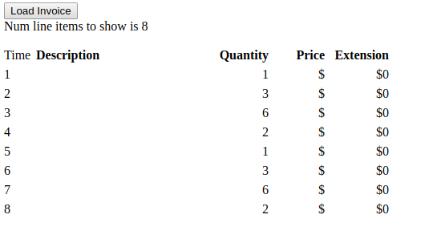

# lookups-test
Ideally the server would be able to return only the id for lookup entities that already exist in state.

With `app.resolvers/product-resolver` in `app.resolvers/resolvers` then everything works as expected:

When instead take out `product-resolver` the issue is illustrated:

Fulcro requires the same product information to be returned from the server as already exists in
app state. Couldn't the merge recognise that having a map with just an id in it means this is a lookup
reference, not a directive to delete product attribute values, apart from their ids?

Looking at `invoice-resolver` you can see that for example `{:product/id 2}` is returned in the map.
But that is just a trigger for `product-resolver` to lookup the rest of the product details. Couldn't
client merging behaviour do the same thing?

As it turns out a fairly straightforward solution is to use `:pre-merge` on Product, returning
`(merge current-normalized data-tree)`. If you returned just `data-tree` that would be the way things
normally work. `current-normalized` is what was there before - the data that in normal merge operation is
being discarded.
